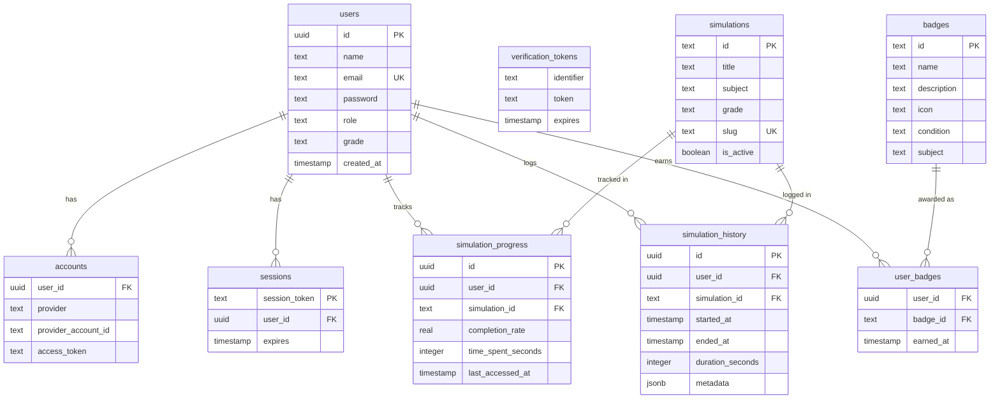

# 🏗️ Arshaka Edu — Backend Architecture

## Tech Stack

| Layer | Technology | Keterangan |
|-------|-----------|------------|
| **Database** | PostgreSQL 16 (Docker) | Container `arshaka_postgres`, port **5433** |
| **ORM** | Drizzle ORM | Type-safe, zero-overhead, migrasi SQL |
| **Auth** | NextAuth.js v5 (beta) | JWT strategy + Credentials provider |
| **API** | Next.js Route Handlers | App Router `/app/api/` |
| **DB Admin** | pgAdmin 4 (Docker) | `http://localhost:5050` |

> [!IMPORTANT]
> **Port Docker PostgreSQL adalah `5433`** (bukan 5432) karena di mesin ini sudah ada PostgreSQL lokal yang berjalan di port 5432.

---

## Database Schema (9 Tabel)



---

## API Endpoints

| Method | Path | Auth | Deskripsi |
|--------|------|------|-----------|
| `GET` | `/api/health` | ❌ | Cek status DB |
| `POST` | `/api/auth/register` | ❌ | Daftar akun baru |
| `POST` | `/api/auth/[...nextauth]` | ❌ | Login / OAuth |
| `GET` | `/api/user/progress?type=progress` | ✅ | Progres semua simulasi |
| `GET` | `/api/user/progress?type=history` | ✅ | Riwayat sesi simulasi |
| `GET` | `/api/user/progress?type=badges` | ✅ | Badge yang dimiliki |
| `GET` | `/api/simulations/track?simulationId=xxx` | ✅ | Progres satu simulasi |
| `POST` | `/api/simulations/track` | ✅ | Catat sesi (start/end) |

### Tracking Payload

**Start sesi:**
```json
{ "simulationId": "gerak-lurus", "action": "start" }
```

**End sesi:**
```json
{
  "simulationId": "gerak-lurus",
  "action": "end",
  "historyId": "uuid-dari-start",
  "durationSeconds": 300,
  "completionRate": 0.85,
  "metadata": { "score": 95, "attempts": 3 }
}
```

---

## File Structure

```
arshaka_edu/
├── docker-compose.yml          # PostgreSQL + pgAdmin containers
├── drizzle.config.ts           # Drizzle ORM config
├── middleware.ts               # Route protection
├── .env.local                  # Environment variables (not in git)
│
├── lib/
│   ├── auth.ts                 # NextAuth v5 configuration
│   └── db/
│       ├── index.ts            # DB connection pool (singleton)
│       ├── schema.ts           # Drizzle schema (semua tabel)
│       ├── seed.ts             # Seed script simulasi & badges
│       └── migrations/         # SQL migration files (auto-generated)
│
└── app/
    └── api/
        ├── health/route.ts
        ├── auth/
        │   ├── [...nextauth]/route.ts
        │   └── register/route.ts
        ├── user/progress/route.ts
        └── simulations/track/route.ts
```

---

## NPM Scripts

```bash
# Docker
npm run docker:up      # Jalankan PostgreSQL + pgAdmin
npm run docker:down    # Matikan containers

# Database
npm run db:generate    # Generate file migrasi SQL dari schema
npm run db:migrate     # Jalankan migrasi (butuh TTY)
npm run db:push        # Push schema langsung ke DB (butuh TTY)
npm run db:studio      # Buka Drizzle Studio (GUI)
npm run db:seed        # Isi data awal simulasi & badges
```

---

## Credentials

| Service | URL | Kredensial |
|---------|-----|------------|
| PostgreSQL | `localhost:5433` | `arshaka` / `arshaka_secret_2025` |
| pgAdmin | `http://localhost:5050` | `admin@arshaka.edu` / `arshaka_admin_2025` |

> [!WARNING]
> Ganti `AUTH_SECRET` di `.env.local` dengan random string yang aman sebelum production!
> Jalankan: `openssl rand -base64 32`

---

## Next Steps

- [ ] Implementasi UI form login/register yang connect ke API
- [ ] Integrasi `useSession` di komponen simulasi untuk tracking otomatis
- [ ] Tambah API `/api/simulations` untuk listing & filtering simulasi
- [ ] Implementasi badge award logic (cek kondisi saat tracking)
- [ ] Tambah OAuth provider (Google / GitHub)
- [ ] Tambah `/api/user/profile` untuk update profil user
